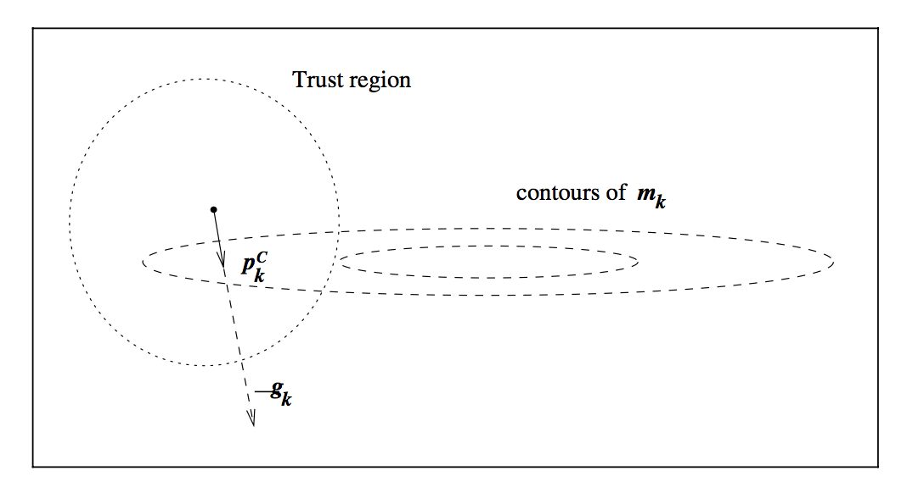
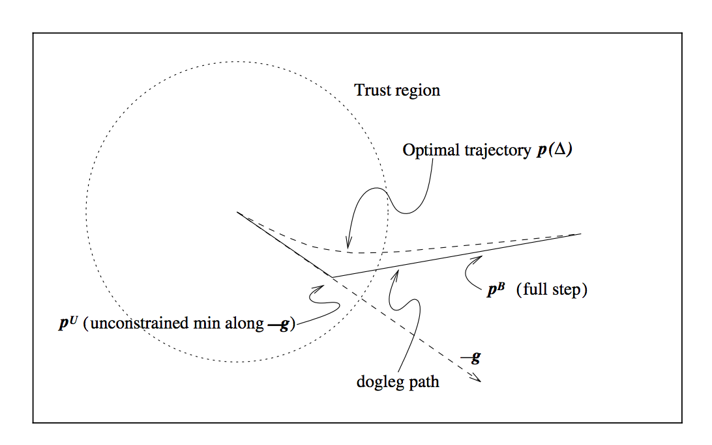

#### Trust Region(置信域方法)

> 在领域内使用二次模型近似, 求解极小值作为下一步更新的标准, 根据预测差与实际差的比值评价近似的好坏, 从而调整领域半径.

一个示例伪代码:
1. initial $x$, $\mu$
2. solve
$$ arg \min_{\Delta x} \frac{1}{2} \parallel J(x)\Delta x +F(x) \parallel ^2$$
$$ s.t. \parallel D(x)\Delta x\parallel ^2 \leqslant \mu$$
$$ L\leqslant x+\Delta x \leqslant U$$
3. $$\rho = \frac{\parallel F(x+\Delta x) \parallel^2 - \parallel F(x) \parallel^2}{\parallel J(x)\Delta x+F(x) \parallel^2-\parallel F(x) \parallel^2}$$
4. if $\rho>\epsilon$ then $x=x+\Delta x$
5. if $\rho>\eta_1$ then $\mu=2\mu$
6. else if $\rho<\eta_2$ then $\mu=\mu*0.5$
7. goto 2

***
#### ADMM(交替方向乘子法, *alternating direction method of multipliers*)

* ** 对偶上升法(Dual Ascent)**

对:
$$ \min f(x) \\ s.t. Ax=b $$
拉格朗日形式为:
$$ L(x, \lambda) = f(x)+\lambda^T(Ax-b) $$
迭代求解形式为:
$$ x^{k+1} = arg \min_x L(x, \lambda^k) \tag 1 $$
$$ \lambda^{k+1} = \lambda^k + \alpha ^k (Ax^{k+1}-b) \tag 2 $$

其中$ \alpha ^k >0 $为步长
意如其名,
(1)给出了$\lambda^k$下最低的曲线, 考虑对偶法求解时, 对偶问题为原问题的下界. 因此, $x^{k+1}$给出了函数簇$ g(\lambda) = L(x, \lambda) $在$\lambda^k$处取得最低值的曲线$ g^* = L(x^{k+1}) $, 也是在该领域内**最接近于**对偶函数D的曲线
由此为求解对偶问题最大值, 在此处使用梯度上升法, 正是(2)的意义

* ** 对偶分解法(Dual Decomposition)**

若目标函数可分解:
$$ f(x) = \sum_{i=1}^N f_i(x_i) $$
则:
$$ L(x, \lambda) = \sum_{i=1}^N(f_i(x_i)+\lambda^TA_ix_i - (1/N)\lambda^Tb) $$
对应地:
$$ x_i^{k+1} = arg \min_{x_i} L_i(x_i, \lambda ^k) \\
	\lambda^{k+1} = \lambda^k + \alpha ^k(Ax^{k+1}-b)
$$

* **增广拉格朗日(Augmented Lagragians)**
$$ L_\rho(x, \lambda) = f(x)+ \lambda ^T(Ax-b) +(\rho/2)||Ax-b||_2^2 \tag 1$$

对应地迭代公式为:
$$ x^{k+1} = arg \min_x L_\rho(x, \lambda ^k) $$
$$	\lambda^{k+1} = \lambda^k+ \rho(Ax^{k+1}-b) \tag 2$$

直观理解, 相比之下(1)中引入了额外的二次误差项, 使得惩罚在偏离较大的时候大幅提高(对于以原始只有线性惩罚), 由此极大地提升了收敛属性(拥有严格的局部极值). 而相应地, 二次项的引入使得$L_\rho$丧失了线性性质, 无法分解

$$\triangledown _x L_\rho = \triangledown _x f + A^T\lambda + \rho A^T(Ax-b) \\
	= \triangledown _x f(x^k+1)+A^T(\lambda ^k+\rho(Ax^{k+1}-b))
$$
所以(2)中$\lambda$更新的步长为$\rho$

* **ADMM**
ADMM试图融合以上的优点: 引入二次误差的同时保持可分解性
对:
$$ \min f(x)+g(z) \\ s.t. Ax+Bz-c=0 $$
同样:
$$ L_\rho = f(x)+g(z)+ y^T(Ax+Bz-c) +(\rho/2)||Ax+Bz-c||_2^2 $$
迭代方式为:
$$ x^{k+1} = arg \min_x L_\rho(x, z^k, \lambda^k) \\
	z^{k+1} = arg \min_z L_\rho(x^{k+1}, z, \lambda^k) \\
    \lambda^{k+1} = \lambda^k + \rho(Ax^{k+1}+Bz^{k+1}-c)
$$

表达式看起来让人想起线性方程组求解的高斯塞德尔(*Gauss-Seidel*)迭代, 使得问题可以被拆解, 比如LASSO问题:
$$ \min \frac{1}{2}||Ax-b||_2^2+ \lambda ||x||_1$$
拆解为两部分获得ADMM形式:
$$ \min \frac{1}{2} ||Ax-b||_2^2 + \lambda ||z||_1 \\
	s.t. x-z=0
$$
即引入$z=x$替换后一项, 这样分别求解
$$ L_\rho= \frac12 ||Ax-b||_2^2 + \lambda ||z||_1 + y^T(x-z)+\frac \rho 2 ||x-z||_2^2 $$
对$x, z, y$的偏导, 就可以得到迭代形式了
如:
$$ \triangledown_x L_\rho = A^T(Ax-b)+y+\rho(x-z) = (A^TA+\rho I)x-(A^Tb+\rho z-y) $$
则, $x$的迭代形式为:
$$ x^{k+1} = (A^TA+\rho I)^{-1}(A^Tb+\rho z^k-y^k) $$

***
#### Dogleg

置信域搜索中需要计算当前区域中的极小值:
$$ \min_{p \in R^n} m_k(p)=f_k + g_k^T p+ \frac12 p^TB_kp \\ s.t. ||p|| \le \Delta \tag 1$$
Dogleg讨论了如何搜索计算这个极点s

* **Cauchy Point**

计算思路直接, 计算(1)的线性形式:
$$ \min_{p \in R^n} m_k(p)=f_k + g_k^T p \\ s.t. ||p|| \le \Delta $$

的极小值, 而后在该方向上获取最小值, 即为柯西点(实际上就是梯度下降法)

Dogleg则给出了一个分段的搜索路径:
式(1)的极小值为:
$$ p_k^B = -B_k^{-1}g_k $$
这是最为理想的更新(full step), 当$p_k^B$在置信域之外时, 计算(1)在梯度方向上的最小值:
$$ p^U = -\frac {g^Tg}{g^TBg} g $$
第二段方向则指向$p_k^B$:

本条路径:的一个特点是, 沿路径方向始终递减, 由此很轻易的可以找到更新

***
#### LMA(Levenberg-Marquardt algorithm)
对**最小二乘问题**:
$$ S(\beta)=|| y-f(\beta)||^2 $$
在$\beta$处进行线性拟合:
$$ S(\beta+\delta) = || y-f(\beta)-J\delta ||^2 \\
	=(y-f(\delta))^T(y-f(\delta))-2(y-f(\delta))^TJ\delta+ \delta^TJ^TJ\delta
$$
对$\delta$求导并令其等于0以获得最佳步长:
$$ (J^TJ)\delta = J^T(y-f(\beta)) \tag 1$$

带阻尼形式为:
$$ (J^TJ+\lambda I)\delta = J^T(y-f(\beta)) \tag L$$
$\lambda$随着迭代进行调整: $S$下降较快时较小, 接近于高斯牛顿, 否则较大(接近于梯度下降: 梯度方向$-2(J^T(y-f(\beta))^T$).
阻尼形式的一个问题是, 当$\lambda$过大时, $(J^TJ+\lambda I)^{-1}$无效.
$$ (J^TJ+\lambda * diag(J^TJ))\delta = J^T(y-f(\beta)) \tag {L-M} $$
L-M形式表达了: 对于下降缓慢的维度给予较大的步长

